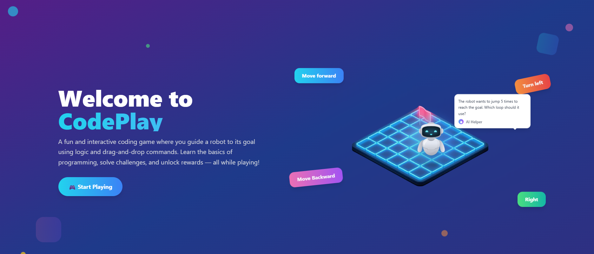
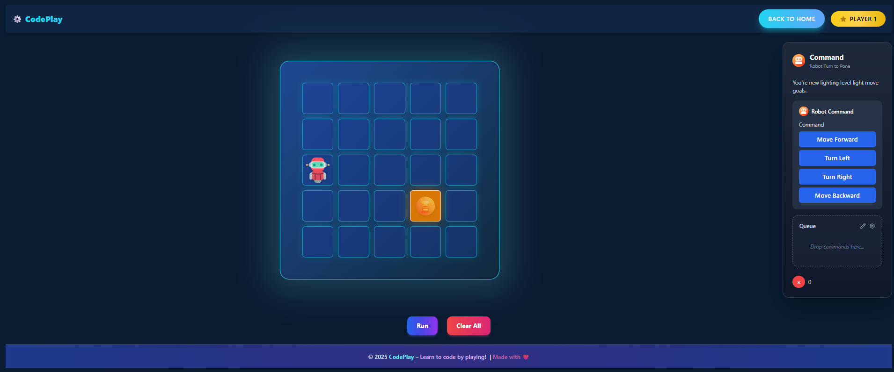

## 🤖 CodePlay – Interactive Coding Game for Kids


<p align="center">
  
</p>

---
## 🎮 About

**CodePlay** is an interactive and educational coding game designed to help children learn programming fundamentals in a fun, engaging way. Kids can drag and drop commands to control a robot, complete levels, and solve challenges that teach essential coding concepts like logic, sequencing, and loops.

---

## 🚀 Features

- 🧩 **Drag-and-Drop Command Blocks** – Easy-to-use UI for kids
- 🤖 **Robot Movement Simulator** – See real-time execution of commands
- ❓ **Fun Coding Quizzes** – Reinforce logic with playful, multiple-choice questions

---


## 🛠️ Tech Stack

<p align="center">
  
  
  
  
  
</p>

---


###  Installation

1. **Clone the repository**
```
git clone https://github.com/your-username/codeplay.git
```

2. **Navigate to project directory**
```
cd codeplay
```


3. **Install dependencies**
```
npm install
```


4. **Start development server**
``` 
npm run dev
```


5. **Open your browser**
 ```
 Navigate to http://localhost:5173
 ```

---


<p align="center">
  
</p>


## 🎯 How to Use

### Step 1: 🏠 **Get Started**
Open the application in your browser to access the welcome screen and choose your first game level.

### Step 2: 🧱 **Drag & Drop Commands**
Use the visual block interface to drag-and-drop coding commands (like move, turn, loop) into the command area to control the robot's movement.

### Step 3: ▶️ **Run & Observe**
Click the "Run" button to watch the robot follow your instructions. Modify and rearrange commands to complete the task successfully.

### Step 4: ❓ **Solve Quizzes**
Answer fun, interactive coding-related questions after each level to reinforce learning and unlock new challenges.

---


## 🤝 Contributing

We welcome contributions from the community! Here's how you can help make SkillSync even better:

### 🔧 **Development Setup**

1. **Fork the repository**
   ```
   git fork https://github.com/symadev/skillsync.git
   ```

2. **Create a feature branch**
   ```
   git checkout -b feature/amazing-feature
   ```


3. **Commit your changes**
   ```
   git commit -m "✨ Add amazing feature"
   ```

4. **Push to your fork**
   ```
   git push origin feature/amazing-feature
   ```

5. **Open a Pull Request**
   - Provide a clear description of changes
   - Include screenshots if applicable
   - Reference any related issues


## 📄 License

This project is licensed under the MIT License - see the [LICENSE](LICENSE) file for details.

---

## 👥 Authors

- **@symadev** - *Initial work* - [GitHub Profile](https://github.com/symadev)

---


